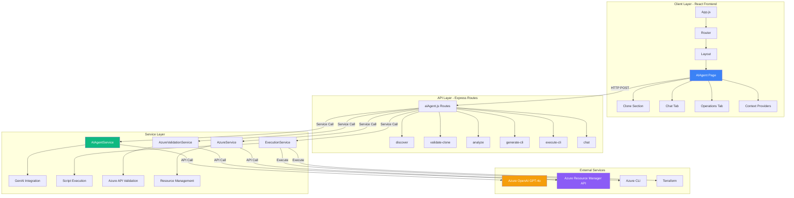
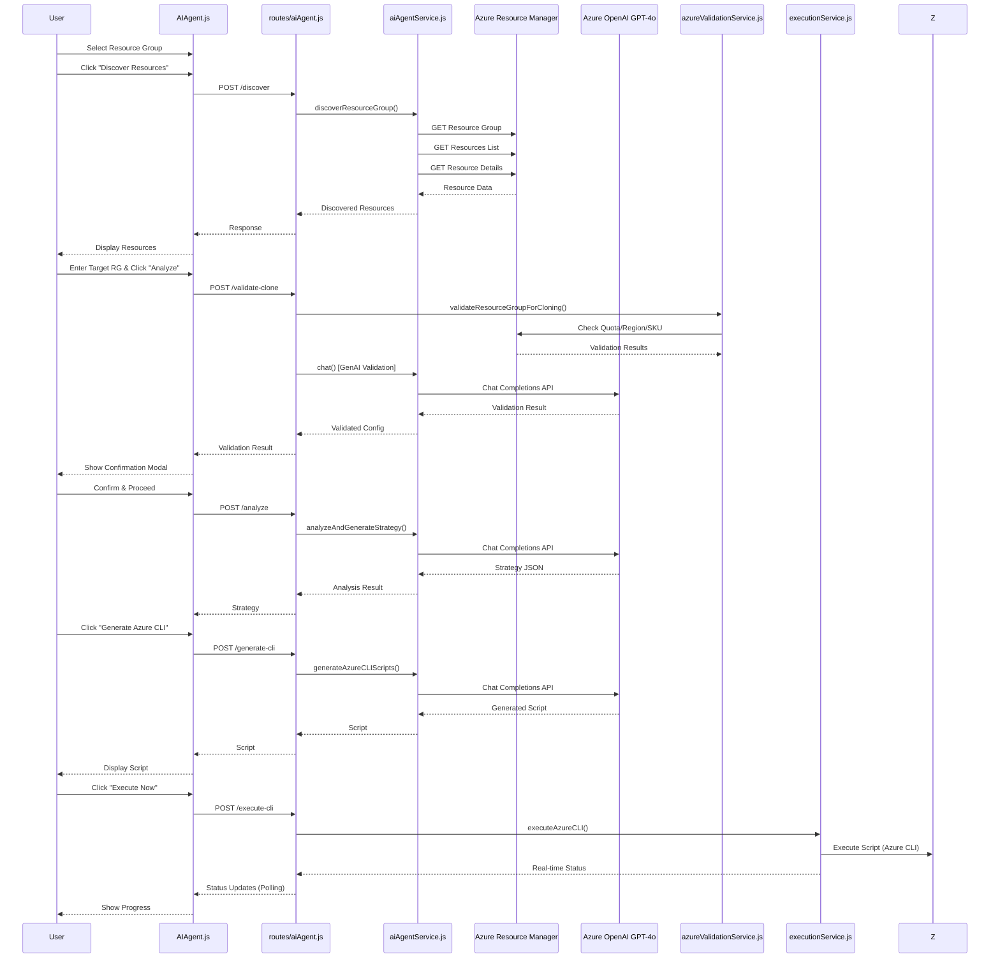
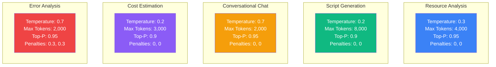
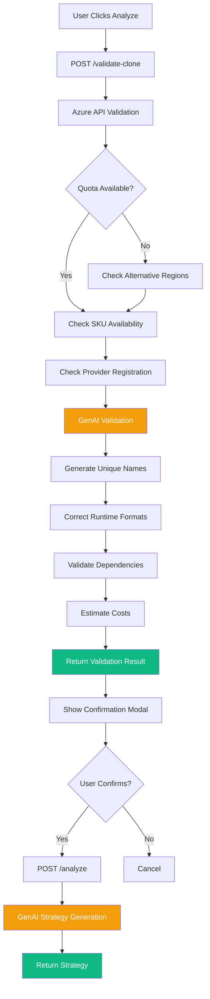
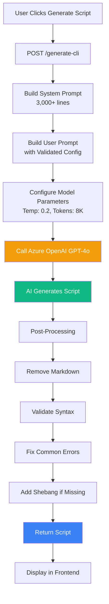
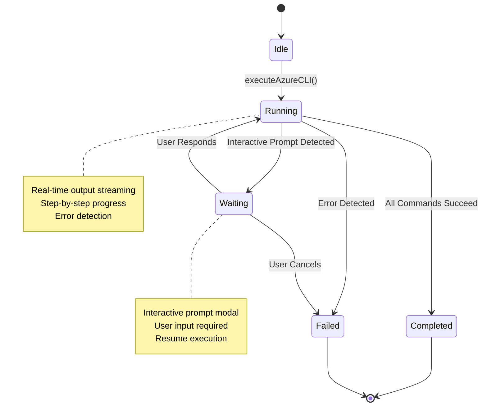
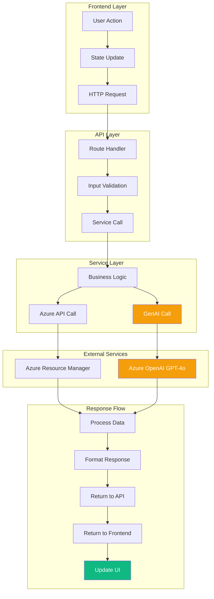
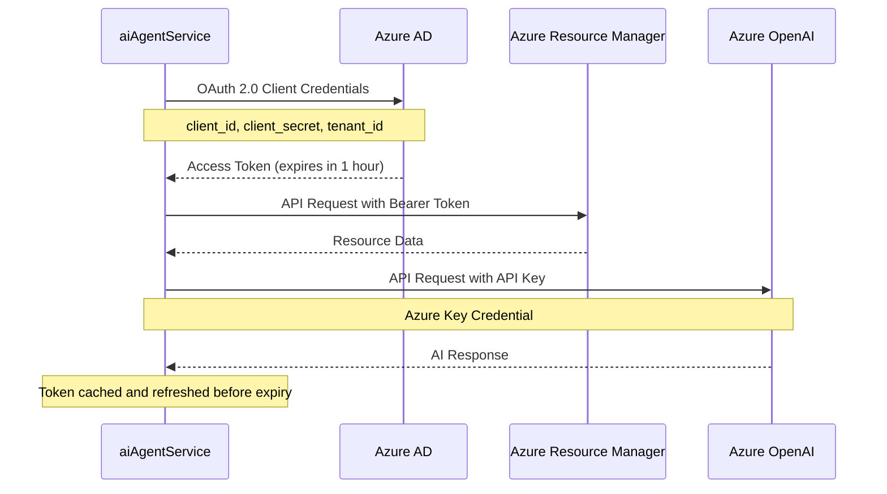
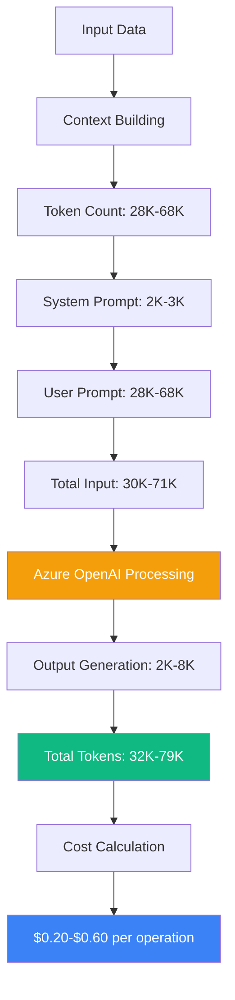

# 🎨 Azure AI Agent - Visual Architecture Diagrams (Mermaid)

## 📊 System Architecture Overview



---

## 🔄 Complete Cloning Workflow



---

## 🤖 GenAI Processing Pipeline

```mermaid
graph LR
    subgraph "Input Collection"
        A[User Input] --> B[Resource Group Data]
        A --> C[Target Configuration]
        A --> D[Validation Results]
    end
    
    subgraph "Context Building"
        B --> E[Context Builder]
        C --> E
        D --> E
        E --> F[Structured Context<br/>28K-68K tokens]
    end
    
    subgraph "Prompt Engineering"
        F --> G[System Prompt<br/>1,500-3,000 lines<br/>2K-3K tokens]
        F --> H[User Prompt<br/>28K-68K tokens]
    end
    
    subgraph "Azure OpenAI GPT-4o"
        G --> I[Model Processing]
        H --> I
        I --> J[Tokenization]
        J --> K[Context Understanding]
        K --> L[Pattern Recognition]
        L --> M[Reasoning & Analysis]
        M --> N[Code Generation]
        N --> O[Output Generation<br/>2K-8K tokens]
    end
    
    subgraph "Post-Processing"
        O --> P[Parse Response]
        P --> Q[Validate Schema]
        Q --> R[Clean & Format]
        R --> S[Error Correction]
    end
    
    subgraph "Output"
        S --> T[Final Result]
        T --> U[Frontend Display]
    end
    
    style I fill:#f59e0b,color:#fff
    style O fill:#10b981,color:#fff
    style T fill:#3b82f6,color:#fff
```



---

## 🧠 GenAI Model Parameters by Use Case



---

## 🔍 Validation & Analysis Flow



---

## 💻 Script Generation Flow



---

## ⚙️ Execution Service Flow



---

## 📡 Data Flow Architecture



---

## 🎯 Component Interaction

```mermaid
graph LR
    subgraph "Frontend Components"
        A[AIAgent.js] --> B[Clone Section]
        A --> C[Chat Tab]
        A --> D[Operations Tab]
        B --> E[Resource Selector]
        B --> F[Discover Button]
        B --> G[Analyze Button]
        B --> H[Generate Buttons]
        C --> I[Chat Messages]
        C --> J[Chat Input]
        D --> K[Operation Query]
        D --> L[Script Display]
    end
    
    subgraph "State Management"
        M[React State] --> N[resourceGroups]
        M --> O[discoveredResources]
        M --> P[analysisStrategy]
        M --> Q[generatedScripts]
        M --> R[executionData]
    end
    
    subgraph "API Calls"
        S[Axios] --> T[/api/ai-agent/discover]
        S --> U[/api/ai-agent/validate-clone]
        S --> V[/api/ai-agent/analyze]
        S --> W[/api/ai-agent/generate-cli]
        S --> X[/api/ai-agent/execute-cli]
        S --> Y[/api/ai-agent/chat]
    end
    
    A --> M
    B --> S
    C --> S
    D --> S
    
    style A fill:#3b82f6,color:#fff
    style M fill:#10b981,color:#fff
    style S fill:#f59e0b,color:#fff
```

---

## 🔐 Security & Authentication Flow



---

## 📊 Token Usage Flow



---

## 🎨 Use These Diagrams In:

1. **PowerPoint/Keynote**: Copy Mermaid code to [Mermaid Live Editor](https://mermaid.live) → Export as PNG/SVG
2. **Markdown Presentations**: Use with [Marp](https://marp.app) or [Reveal.js](https://revealjs.com)
3. **Documentation**: Embed directly in Markdown (GitHub supports Mermaid)
4. **Online Tools**: 
   - [Mermaid Live Editor](https://mermaid.live)
   - [Draw.io](https://app.diagrams.net) (import Mermaid)
   - [Excalidraw](https://excalidraw.com)

---

**All diagrams are optimized for customer presentations and technical discussions!**

