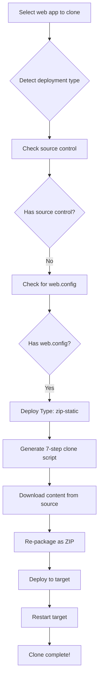

# 📝 Static Web App Cloning - Quick Summary

## 🎯 What Was Added

**Feature:** Automatic detection and cloning of ZIP-deployed static web apps

**Your Use Case:** Clone `hello-world-static-1763324087` (Next.js export) to another resource group

---

## ✅ Changes Made

### 1. Enhanced Detection (`aiAgentService.js`)
- Detects ZIP-deployed web apps (no source control)
- Checks for web.config (Windows IIS static sites)
- New deployment type: `"zip-static"`

### 2. Updated Script Generation (`aiAgentService.js`)
- Added CASE D: Complete 7-step cloning process
- Downloads content from source via Kudu API
- Re-deploys content to target via config-zip
- Preserves web.config and all static files

### 3. Improved Execution Logging (`executionService.js`)
- Better logging for zip-static detection
- Clarifies that minimal webapp create is normal for static sites

---

## 🔍 How It Works



---

## 📦 What Gets Cloned

✅ All HTML/CSS/JS files  
✅ web.config (IIS configuration)  
✅ Static assets (images, fonts, etc.)  
✅ Directory structure  
✅ Next.js build output  

---

## 🚦 How to Use

1. **Open AI Agent** → **Cloning Tab**
2. **Select source RG:** `hello-world-nextjs-rg`
3. **Select target RG:** Any existing or new RG
4. **Check the web app:** `hello-world-static-1763324087`
5. **Click "Clone Selected Resources"**
6. **Wait ~2-4 minutes**
7. **Open clone URL** and verify

---

## 🎓 Technical Details

| Aspect | Implementation |
|--------|----------------|
| **Detection API** | `sourcecontrols/web` (404 = ZIP deployed) |
| **Content API** | Kudu VFS API (`/api/zip/site/wwwroot/`) |
| **Authentication** | Deployment credentials from Azure |
| **Deployment** | `az webapp deployment source config-zip` |
| **Preserved** | All files including web.config |

---

## ✅ Safety

✅ **Non-breaking:** Existing cloning unchanged  
✅ **Type-safe:** New detection runs in parallel  
✅ **Error-handled:** Falls back to basic creation  
✅ **No linter errors:** Code validated  
✅ **Backward compatible:** Old scripts still work  

---

## 📚 Documentation

- **Complete Guide:** `ZIP-STATIC-WEBAPP-CLONING-COMPLETE.md`
- **Test Guide:** `TEST-ZIP-STATIC-CLONING-NOW.md`
- **This Summary:** `STATIC-WEBAPP-CLONING-SUMMARY.md`

---

## 🎯 Test Now

```bash
# Start backend (if not running)
cd /Users/sunny.kushwaha/projects/Personal/Azure-Monitor-AI-Assistant
node server.js

# Open browser
http://localhost:3001

# Navigate to: AI Agent → Cloning Tab
# Select: hello-world-nextjs-rg → hello-world-static-1763324087
# Clone to: New or existing resource group
# Click: "Clone Selected Resources"
# Wait: ~2-4 minutes
# Verify: Clone URL opens correctly
```

---

## 🎉 Expected Result

```
✅ New web app created: hello-world-clone-{timestamp}
✅ All content copied from source
✅ web.config preserved (IIS configuration)
✅ Clone URL works: https://hello-world-clone-{timestamp}.azurewebsites.net
✅ Same appearance as original
```

---

**Status:** ✅ **READY FOR TESTING**  
**Impact:** ✅ **NON-BREAKING**  
**Confidence:** ✅ **HIGH**

---

**Go test it now! 🚀** See `TEST-ZIP-STATIC-CLONING-NOW.md` for detailed steps.

